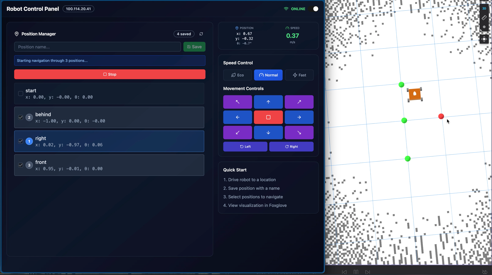

# Robot Control Dashboard

A web-based control panel for ROS2-powered mecanum wheel robots, enabling manual teleoperation, waypoint management, and multi-position autonomous navigation. Visualization is supported through [Foxglove Studio](https://foxglove.dev/studio) for real-time monitoring of robot state, sensor data, and saved positions.

This project (React WebApp + ROS2 workspace) serves as the foundation for warehouse automation implementation, where the waypoint navigation system can be extended toward full QR-based package sorting and autonomous delivery tasks.

<div align="center">
  
  <p><em>Dashboard interface with Foxglove Studio 3D panel</em></p>
</div>

### Key Features

- **Manual Teleoperation**: 8-directional movement pad with rotation controls
- **Speed Modes**: Eco (60%), Normal (100%), and Fast (160%) speed presets
- **Position Management**: Save, view, and delete navigation waypoints
- **Multi-Waypoint Navigation**: Queue multiple positions for sequential autonomous navigation
- **Real-time Telemetry**: Live display of robot position, orientation, and speed
- **Multi-Robot Support**: Switch between different robots via dropdown selector

## Architecture

```
┌─────────────────────────────────────────────────────────────────┐
│                        Web Browser                              │
│  ┌──────────────┐  ┌──────────────┐  ┌──────────────────────┐   │
│  │ControlButtons│  │ StatusDisplay│  │  PositionManager     │   │
│  └──────┬───────┘  └──────┬───────┘  └──────────┬───────────┘   │
│         │                 │                     │               │
│  ┌──────┴─────────────────┴─────────────────────┴────────────┐  │
│  │                    Hooks Layer                            │  │
│  │   useRobot (movement)    usePosition (waypoints)          │  │
│  └──────────────────────────┬────────────────────────────────┘  │
│                             │                                   │
│  ┌──────────────────────────┴────────────────────────────────┐  │
│  │                   Services Layer                          │  │
│  │   rosService (connection)    positionService (waypoints)  │  │
│  └──────────────────────────┬────────────────────────────────┘  │
└─────────────────────────────┼───────────────────────────────────┘
                              │ WebSocket (JSON)
                              ▼
┌─────────────────────────────────────────────────────────────────┐
│                    rosbridge_server:9090                        │
└─────────────────────────────┬───────────────────────────────────┘
                              │ DDS
                              ▼
┌─────────────────────────────────────────────────────────────────┐
│                         ROS2 Nodes                              │
│        (See Related resources for ROS2 packages)                │
└─────────────────────────────────────────────────────────────────┘
```

## Tech Stack

| Category          | Technology               |
| ----------------- | ------------------------ |
| Framework         | React + TypeScript       |
| Styling           | TailwindCSS + shadcn/ui  |
| ROS Communication | roslibjs via rosbridge   |
| Build Tool        | Vite                     |
| Icons             | Lucide React             |
| Notifications     | Sonner                   |

## Prerequisites

- Node.js 18+ and npm
- Network access to the robot (same network or via Tailscale VPN)
- ROS2 workspace running on the robot (See Related resources for ROS2 packages)

## Installation

1. **Clone the repository**

   ```bash
   git clone <repository-url>
   cd rmitbot-dashboard
   ```

2. **Install dependencies**

   ```bash
   npm install
   ```

3. **Configure robot IP addresses**

   Edit `src/config.ts` to add your robot's IP addresses:

   ```typescript
   export const ROBOT_OPTIONS = [
     { ip: "100.118.27.83", name: "Robot 1" },
     { ip: "192.168.1.100", name: "Robot 2" },
     // Add more robots as needed
   ] as const;
   ```

4. **Start the development server**

   ```bash
   npm run dev
   ```

5. **Access the dashboard**

   Open `http://localhost:5173` in your browser.

## Project Structure

```
src/
├── components/           # React UI components
│   ├── ui/              # shadcn/ui base components
│   ├── ControlButtons.tsx    # Directional pad
│   ├── SpeedControl.tsx      # Speed mode selector
│   ├── StatusDisplay.tsx     # Telemetry display
│   └── PositionManager.tsx   # Waypoint management
├── hooks/               # React custom hooks
│   ├── useRos.ts            # Connection state management
│   ├── useRobot.ts          # Robot control logic
│   └── usePosition.ts       # Waypoint state management
├── services/            # ROS communication layer
│   ├── ros2Connection.ts    # WebSocket connection singleton
│   └── positionService.ts   # Position-related ROS calls
├── config.ts            # Robot IPs and ROS configuration
├── types.ts             # TypeScript type definitions
├── App.tsx              # Main application component
└── main.tsx             # Application entry point
```

## Usage

### Manual Control

1. Toggle the connection switch to connect to the robot
2. Select a speed mode (Eco/Normal/Fast)
3. Use the directional buttons to drive:
   - Arrow buttons for forward/backward/left/right movement
   - Diagonal buttons for combined movement
   - Rotation buttons for turning in place
   - Center stop button to halt all movement

### Position Management

1. Drive the robot to a desired location
2. Enter a name in the position input field
3. Click "Save" to store the current position
4. Saved positions appear in the list below

### Multi-Waypoint Navigation

1. Select multiple positions by clicking their checkboxes
2. Positions are queued in selection order (numbered badges show sequence)
3. Click "Navigate" to start autonomous navigation
4. Monitor progress via status messages
5. Click "Stop" to cancel navigation at any time

### Switching Robots

Use the dropdown in the header to switch between configured robots. The connection will automatically transfer to the new robot's IP address.

### Visualization with Foxglove

1. Open [Foxglove Studio](https://foxglove.dev/studio)
2. Connect to `ws://<robot-ip>:8765`
3. Visualize the map, robot position, laser scans, and saved position markers

## Configuration Reference

### `src/config.ts`

```typescript
export const ROSBRIDGE_PORT = 9090;

export const ROBOT_OPTIONS = [
  { ip: "100.118.27.83", name: "RPI" },
  { ip: "100.68.218.48", name: "Ubuntu" },
] as const;

export const ROS_CONFIG = {
  DEFAULT_IP: ROBOT_OPTIONS[0].ip,
  ROSBRIDGE_PORT: 9090,
  RECONNECT_INTERVAL: 3000, // ms between reconnection attempts
  SPEED: 0.5, // Base linear speed (m/s)
  TURN: 1.0, // Base angular speed (rad/s)
  PUBLISH_RATE: 10, // Velocity publish rate (Hz)
};
```

## Related Resources

- [ED3_RMITBOT_GROUP_C](https://github.com/SolidRhain/ED3_RMITBOT_GROUP_C) - ROS2 workspace containing position_manager and other robot packages
- [Foxglove Studio](https://foxglove.dev/studio) - Visualization tool
- [roslibjs](https://github.com/RobotWebTools/roslibjs) - ROS JavaScript library
